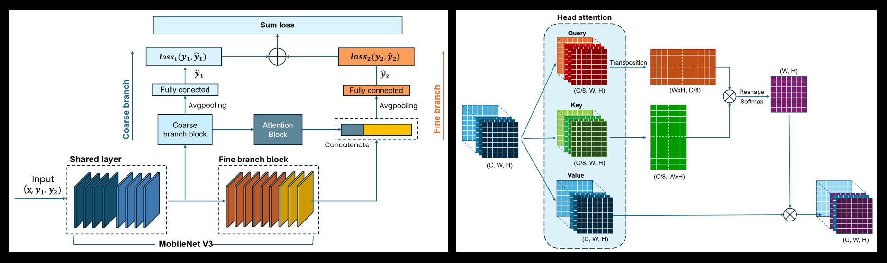

# Upper Gastrointestinal endoscopic landmark classification using Hierarchical Neural Network
[](https://www.python.org/downloads/release/python-3100/)
[](https://pytorch.org/get-started/previous-versions/)
[](hhttps://pytorch.org/get-started/previous-versions/)
[](https://developer.nvidia.com/cuda-12.1-download-archive)

***Author:Jonny Truong***
## 1. Overview
This research is funded by <span style="color:orange;"><b>The Viet Nam Ministry of Science and Technology under
Grant No. KC-4.0-17/19-25 "Research and Develop Intelligent Diagnostic Assistance
System for Upper Gastrointestinal Endoscopy Images"</b></span>. In this task, we propose a method to classify upper gastrointestinal endoscopic landmarks based on the Hierarchical Neural Network architecture.

## 1. Format data
Each input data sample has a size of 224x224 and is assigned 2 labels corresponding to 2 branches: coarse branch and fine branch.

    
    ├── Non-Informative frames/            
    │   ├── Unkown        
    │   ├── Blur     
    │   ├── Foam/Fluid 
    │   └── Dark
    └── Informative frames/
        ├── Pharynx        
        ├── Oesophagus     
        ├── Squamocolumnar junction
        ├── Middle upper body
        ├── Fundus
        ├── Antrum
        ├── Angulus
        ├── Greater curvature
        ├── Lesser curvature
        └── Dark
## 2. Model architecture
To accommodate deployment on Jetson AGX Xavier, we use the MobileNet V3 architecture as the backbone of the Hierarchical model. The attention mechanism is used to increase the binding between classification branches and improve generalization in fine branch.
<p align="center"> </p>

## 3. Results
## I. Deployment with video input
- To run and show the result of the model with video input, run the following command:
```bash
python check.py
```
- To save the result of the model as each imge foldes, simulator video with video input, run the following command:
```bash
python check.py --save_image --save_vid
python check.py --video_path "path_to_video" --frame-rate 30 # default frame rate 20
```


